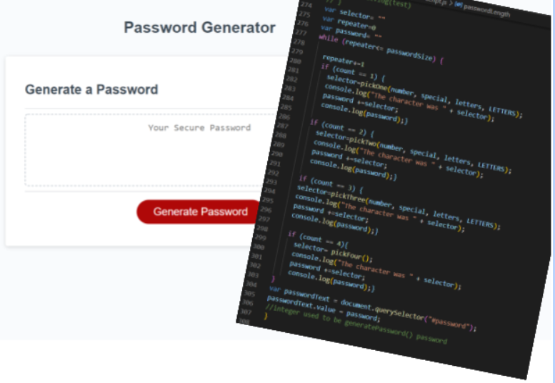

# Password Random Generator 
Github application: https://azuryte5.github.io/Assignment3-password/
Github repository: https://github.com/azuryte5/Assignment3-password



# Application Process
When you click the the generate password button. A series of prompts appear. Once proper information is submitted by the user a password of valid 
length appears in the textarea. This password is built by a couple of functions that work together to generate a password.
writePassword() collects the password length from passwordLength() and based on the answers from the 4 confirm questions, one of four functions will run. The count variable will either us pickOne, pickTwo, PickThree, PickFour. This is because there are 15 valid (all false returns error) combinations of numbers, special characters, lowercase and uppercase letters and these four functions will pick a random character for each character of password.
While, if, repeater variable connect to add the random characters to the password until the passwordSize is met.
Lastly, the generated password is presented to the user with passwordText.

# unique comments
* I noticed that my pickFour was failing when password count was low (8) at returning a character from each category 30%. Made var balance to adjust and return less errors.
* PickThree fails about 12% (1/8) of the time (on password length of 8) but I had to move on. If it happens just reroll and it will work. I could have added a balance variable counting to 3 but it was time to move on to other work.

## User Story
```
AS AN employee with access to sensitive data
I WANT to randomly generate a password that meets certain criteria
SO THAT I can create a strong password that provides greater security
```

## Acceptance Criteria

```
GIVEN I need a new, secure password
WHEN I click the button to generate a password
[✅]THEN I am presented with a series of prompts for password criteria
WHEN prompted for password criteria
[✅]THEN I select which criteria to include in the password
WHEN prompted for the length of the password
[✅]THEN I choose a length of at least 8 characters and no more than 128 characters
WHEN asked for character types to include in the password
[✅]THEN I confirm whether or not to include lowercase, uppercase, numeric, and/or special characters
WHEN I answer each prompt
[✅]THEN my input should be validated and at least one character type should be selected
WHEN all prompts are answered
[✅]THEN a password is generated that matches the selected criteria
WHEN the password is generated
[✅]THEN the password is either displayed in an alert or written to the page